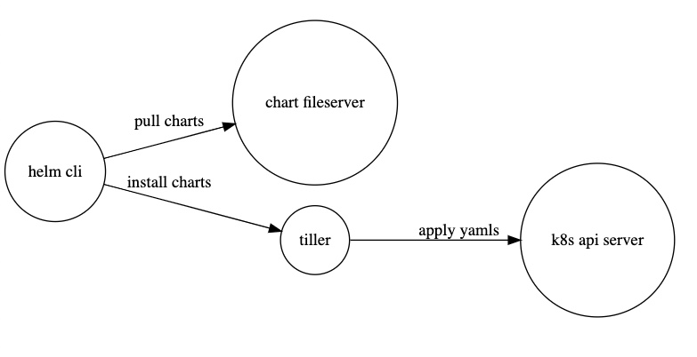
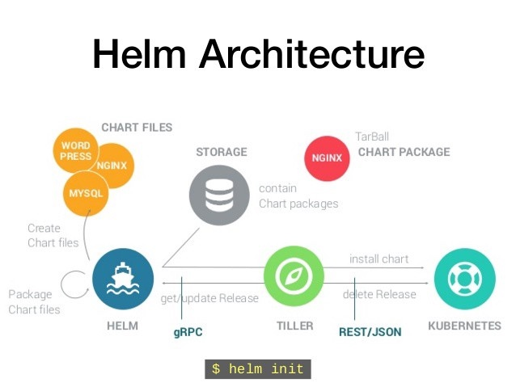

本文将介绍 Helm 中的相关概念和基本工作原理。

# Helm 是什么?

Helm 是 Kubernetes 的包管理器。包管理器类似于我们在 Ubuntu 中使用的apt、Centos中使用的yum 或者Python中的 pip 一样，能快速查找、下载和安装软件包。

`Helm v2` 由客户端组件 helm 和服务端组件 Tiller 组成, `Helm v3` 去掉了 Tiller 组件。

他们都能够将一组K8S资源打包统一管理, 是查找、共享和使用为Kubernetes构建的软件的最佳方式。

# Helm 解决了什么痛点？

在 Kubernetes 中部署一个应用，需要涉及到很多的 Kubernetes 资源的共同协作。比如你安装一个 WordPress 博客，用到了一些 Kubernetes 的一些资源对象，包括 Deployment 用于部署应用、Service 提供服务发现、Secret 配置 WordPress 的用户名和密码，可能还需要 pv 和 pvc 来提供持久化服务。并且 WordPress 数据是存储在mariadb里面的，所以需要 mariadb 启动就绪后才能启动 WordPress。这些 k8s 资源过于分散，不方便进行管理。

Helm 能很好的解决以下几个问题：

- 统一管理、配置和更新分散的 k8s 的应用资源文件
- 分发和复用一套应用模板
- 将应用的一系列资源当做一个软件包管理

# Helm 相关组件及概念

这里先介绍 Helm v2，其包含两个组件，分别是 helm 客户端 和 Tiller 服务器：

- **helm** 是一个命令行工具，用于本地开发及管理chart，chart仓库管理等
- **Tiller** 是 Helm 的服务端。Tiller 负责接收 Helm 的请求，与 k8s 的 apiserver 交互，根据 chart 来生成一个 release 并管理 release
- **chart** chart 是 Helm 的打包格式, 就是一系列文件, 它描述了一组相关的 k8s 集群资源
- **release** 使用 helm install 命令在 Kubernetes 集群中部署的 Chart 称为 Release
- **Repoistory** Helm chart 的仓库，Helm 客户端通过 HTTP 协议来访问存储库中 chart 的索引文件和压缩包

# Helm 原理

下面两张图描述了 Helm 的几个关键组件 Helm（客户端）、Tiller（服务器）、Repository（Chart 软件仓库）、Chart（软件包）之间的关系以及它们之间如何通信




## 创建release

- helm 客户端从指定的目录或本地tar文件或远程repo仓库解析出chart的结构信息
- helm 客户端指定的 chart 结构和 values 信息通过 gRPC 传递给 Tiller
- Tiller 服务端根据 chart 和 values 生成一个 release
- Tiller 将install release请求直接传递给 kube-apiserver

## 删除release

- helm 客户端从指定的目录或本地tar文件或远程repo仓库解析出chart的结构信息
- helm 客户端指定的 chart 结构和 values 信息通过 gRPC 传递给 Tiller
- Tiller 服务端根据 chart 和 values 生成一个 release
- Tiller 将delete release请求直接传递给 kube-apiserver

## 更新release

- helm 客户端将需要更新的 chart 的 release 名称 chart 结构和 value 信息传给 Tiller
- Tiller 将收到的信息生成新的 release，并同时更新这个 release 的 history
- Tiller 将新的 release 传递给 kube-apiserver 进行更新

# chart 的基本结构

Helm的打包格式叫做chart，所谓chart就是一系列文件, 它描述了一组相关的 k8s 集群资源。Chart中的文件安装特定的目录结构组织, 最简单的chart 目录如下所示：

```
.
├── charts
├── Chart.yaml
├── templates
│   ├── deployment.yaml
│   ├── _helpers.tpl
│   ├── ingress.yaml
│   ├── NOTES.txt
│   └── service.yaml
└── values.yaml

```

- charts 目录存放依赖的chart
- Chart.yaml 包含Chart的基本信息，包括chart版本，名称等
- templates 目录下存放应用一系列 k8s 资源的 yaml 模板
- _helpers.tpl 此文件中定义一些可重用的模板片断，此文件中的定义在任何资源定义模板中可用
- ingress.yaml 描述了使用 ingress 暴露服务的方式
- NOTES.txt 介绍chart 部署后的帮助信息，如何使用chart等
- values.yaml 包含了必要的值定义（默认值）, 用于存储 templates 目录中模板文件中用到变量的值